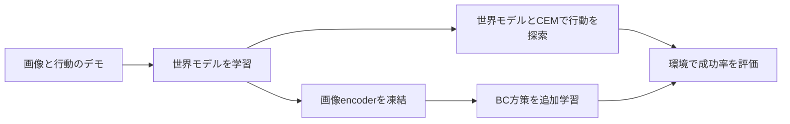

# BT-SIGReg

**画像と行動の記録から、複数の操作タスクに使える小型の世界モデルを学ぶ研究リポジトリです。** PushTで基本動作を確認し、LIBERO-10では10タスクを1つの世界モデルで学習します。

世界モデルは「この画像の状態で、この行動をすると、次にどう変わるか」を画像の特徴空間で予測します。BT-SIGRegは、その予測に使う状態と、表現の崩壊を防ぐ正則化に使う座標を分ける方法です。報酬・タスクID・目標は世界モデルの学習入力に使いません。

## 今の研究の進め方

**Raw／TC／BTの条件を揃え、世界モデルの予測と、固定したCEMによる制御成績を比較します。** 最初に[比較評価の手順](mylewm/docs/COMPARISON_PROTOCOL.ja.md)と[既存実験の一覧](mylewm/docs/EXPERIMENTS.ja.md)を確認してください。公式LeWMとの参考比較、方式間の主比較、補助診断を分けて結果を蓄積します。

BCは視覚表現の補助評価です。世界モデルの未来予測器を使う制御とは異なり、追加学習は必須工程ではありません。CEM改良も主比較の途中で方式別に行わず、比較条件を固定します。

## はじめに読む4つのガイド

| 順番 | ガイド | 分かること |
|---|---|---|
| 1 | [アルゴリズム](mylewm/docs/ALGORITHM.ja.md) | 世界モデル、SIGReg、Raw／TC／BTの違い、何が保証されるか |
| 2 | [実装](mylewm/docs/IMPLEMENTATION.ja.md) | 入力から予測までの流れ、主要ファイル、保存形式 |
| 3 | [学習](mylewm/docs/TRAINING.ja.md) | 環境・データの準備、BT学習、BC学習、再開と完了確認 |
| 4 | [評価](mylewm/docs/EVALUATION.ja.md) | 世界モデル制御と補助評価の区別、実行と結果確認 |

初めての方は1から順に、既存runを操作する方は[運用記録](mylewm/docs/AGENT_OPERATIONS.ja.md)を確認してください。[文書一覧](mylewm/docs/README.md)には研究資料と個別レポートもあります。

## 学習したモデルをどう使うか

CEMは未来を予測して行動を探します。BC（行動模倣）は画像からデモの行動を出す方策を別に学習します。LIBEROのBCにはタスクIDを渡します。この2経路は異なる能力を測るため、成績を混ぜません。

## 現在の実験設定と検証範囲

これまでにPushTのBT学習・制御評価、LIBEROの旧BT100kと再生成データBT10kの学習・診断、補助的なBC学習を実施しました。これらは条件の異なる実験であり、Raw／TC／BTの主比較が完成したことを意味しません。どの結果を再利用できるか、何が不足しているかは[実験一覧](mylewm/docs/EXPERIMENTS.ja.md)に整理しています。

実施済みの例として、旧PushT BT100kの固定200ケースは178成功、旧LIBERO BT100k＋CEMの各タスク1試行は0/10でした。学習データ・方策・予算が違う結果を直接比較しません。BTが同予算のRaw／TCより優れることは未実証です。[検証状況](mylewm/docs/VALIDATION.ja.md)

学習の完了・稼働状況は文書の更新日時から推測せず、対象runのログ・完了記録と実プロセスで確認します。

## ディレクトリ

| 場所 | 内容 |
|---|---|
| `src/mylewm/` | アルゴリズム、データ処理、学習、評価、方策の実装 |
| `mylewm/configs/`・`mylewm/tests/` | 設定例と回帰テスト |
| `mylewm/docs/` | 4つのガイド、研究資料、実験記録 |
| `scripts/` | 環境起動・評価・手動進捗確認のシェル |
| `lewm/` | 比較用LeWMコード。ローカル評価修正を含む |
| `output/`・`.cache/` | データ、checkpoint、動画、ログ（Git対象外） |

リポジトリはeditableインストールで使用します。最初の環境準備は[学習ガイド](mylewm/docs/TRAINING.ja.md#setup)、コードを変更する場合の確認方法は[実装ガイド](mylewm/docs/IMPLEMENTATION.ja.md#tests)を参照してください。
