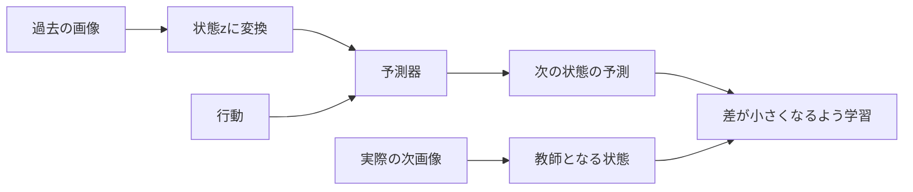

# 1. 世界モデルとBT-SIGReg

[入口](README.md) · [次：実装](IMPLEMENTATION.ja.md)

## 世界モデルとは

例えば、T字の物体を右から押すと、位置や向きが変わります。世界モデルは画像と行動の記録から、このような変化を予測するモデルです。

この実装は次の画像を直接描く代わりに、画像を数値ベクトルへ変換して、その変化を予測します。このベクトルを**状態z**と呼びます。各成分の意味を人が決めるわけではありません。

学習には通常の画像・行動の軌道を使います。報酬やタスクID、目標画像は世界モデルの学習入力にしません。

## LeWMはどう学ぶか

学習では「予測した状態」と「実際の次画像から得た状態」の誤差を小さくします。ただし、全画像を同じベクトルへ変換すれば、内容を理解しなくても誤差を小さくできます。これを**表現の崩壊**と呼びます。

LeWMはこれを防ぐため、状態の分布を標準ガウス分布へ近づける**SIGReg**という正則化を加えます。正則化とは、予測誤差に加えて学習へ課す条件です。

## BTは何を変えるか

| 方式 | 予測に使う状態 | SIGRegをかける場所 |
|---|---|---|
| Raw LeWM | z | zそのもの |
| BT-SIGReg | z | 学習専用の変換Tを通したT(z) |

BTは、予測に使うzと、正則化する座標を分けます。狙いは、崩壊を防ぎながら予測しやすい表現を学ぶことです。成功率が必ず上がる保証はありません。

Tが自由に拡大・縮小すると、数値の尺度を変えるだけで誤差を下げる抜け道ができます。そのため、Tには距離をどの程度変えてよいかの固定した上下限を設けます。現行実装はCayley特異値制約v2です。[数式と導出](research/BT_SIGREG.ja.md)

## 学習したモデルでどう動くか

目標画像を状態に変換し、候補の行動列を世界モデルで予測します。予測した到達状態が目標に近くなる行動を、CEMという探索方法で選びます。**このときTは使わず、予測器とzを使います。**

BC（行動模倣）は画像からデモ行動を出す別の方策を学ぶ方法です。このリポジトリのBCは未来予測器を使わないため、世界モデルの制御評価の必須工程ではありません。

BTの効果は、同じデータ・初期値・学習予算・探索条件のRawと比較して確かめます。[次章では、この流れを実装に対応付けます](IMPLEMENTATION.ja.md)。
