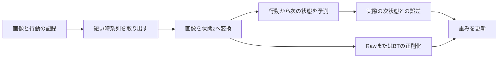

# 2. 実装を読む

[前：アルゴリズム](ALGORITHM.ja.md) · [次：学習](TRAINING.ja.md)

実装は`src/mylewm/`にあります。`mylewm/`には設定・テスト・文書、`lewm/`には比較用のLeWMコードがあります。

## 学習の流れ



PushTでは4時刻の画像を取り出し、過去3時刻の状態と行動から次の状態を予測します。未来の実画像も同じ画像encoderで状態に変換し、教師にします。教師側にも勾配を流して学習します。

RawとBTの違いは正則化部分です。画像の処理や予測器、データ順、更新方法は共通にします。BTの変換Tは学習時だけ使い、評価用モデルからは除きます。

## まず見るファイル

| 役割 | ファイル |
|---|---|
| PushTのデータ分割とmanifest作成 | [prepare_pusht_comparison.py](../../src/mylewm/data/prepare_pusht_comparison.py) |
| PushTのRaw／BT学習、保存・再開 | [train.py](../../src/mylewm/training/train.py) |
| LeWMの世界モデル | [jepa.py](../../lewm/jepa.py) |
| BTの変換T | [bt_sigreg.py](../../src/mylewm/algorithms/bt_sigreg.py) |
| PushTの環境評価の入口 | [evaluate_pusht.sh](../../scripts/evaluate_pusht.sh) |

最初から全ファイルを読む必要はありません。学習処理を追うなら`train.py`、BTの数学的な実装を見るなら`bt_sigreg.py`から進みます。

## 保存形式を区別する

評価用の`step_N_object.ckpt`は、予測と行動探索に必要な世界モデルです。学習再開用のcheckpointには、それに加えてoptimizer、学習率、乱数、BTのTの状態が必要です。両者を取り違えないでください。

<a id="tests"></a>
## 変更したコードを確認する

関連テストを実行します。全体の回帰テストの入口は次です。

```bash
CUBLAS_WORKSPACE_CONFIG=:4096:8 .venv/bin/python -m pytest mylewm -q
```

テスト合格と環境での操作成功は別です。文章だけを変更した場合は、リンクと記載したコマンドの整合を確認します。

LIBEROの2カメラやBCなど、別経路の詳細は[補足資料](reference/README.md)にまとめています。
